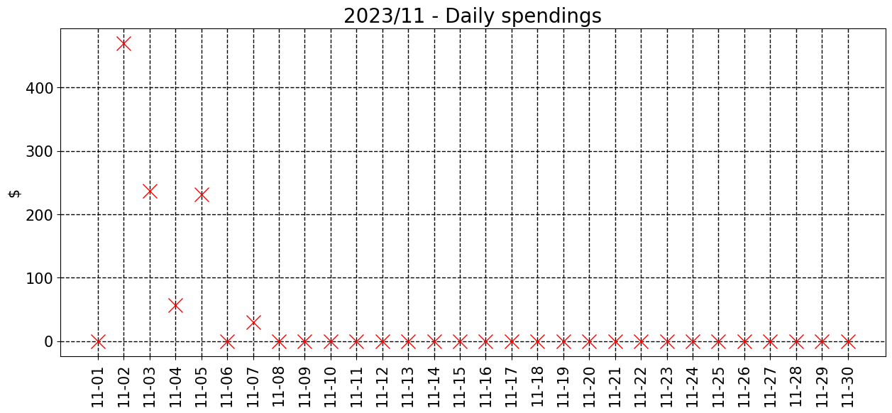
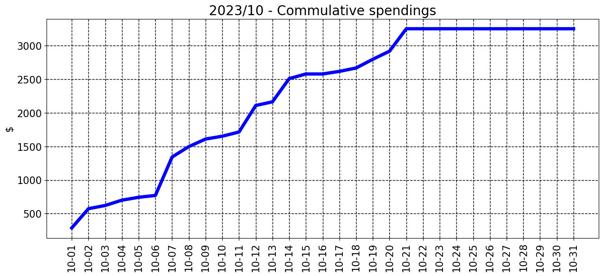
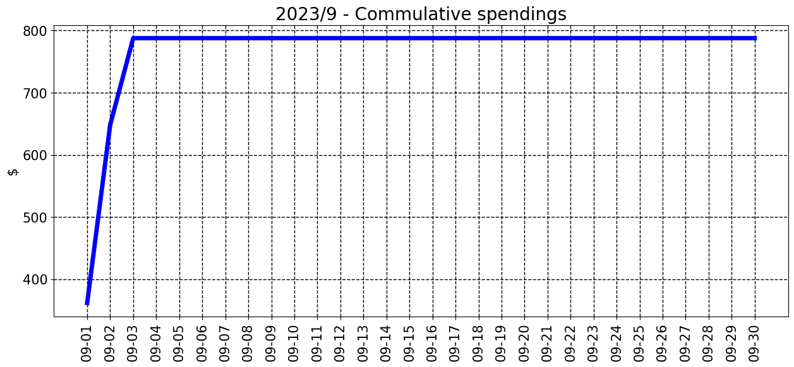
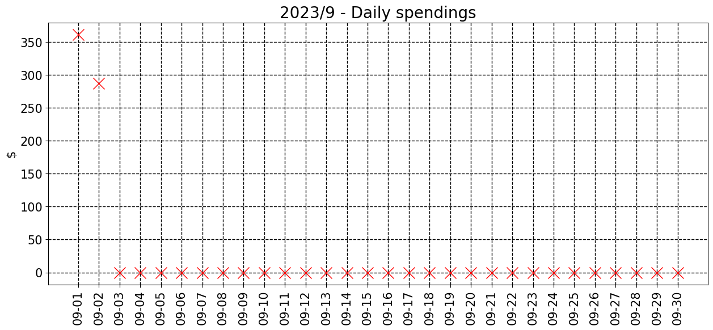

### 2023/11

__________________________________

| Spent | Avg daily | End of month projection | Spent since 2023/7 |
|---|---|---|---|
| $7122.0  |  $254.4  | $7632.0  |  $27426.0  |

__________________________________

### 2023/10

__________________________________

| Spent | Avg daily | End of month projection | Spent since 2023/7 |
|---|---|---|---|
| $4945.0  |  $159.5  | $4944.0  |  $20304.0  |

__________________________________

### 2023/9

__________________________________

| Spent | Avg daily | End of month projection | Spent since 2023/7 |
|---|---|---|---|
| $10134.0  |  $337.8  | $10134.0  |  $15359.0  |

__________________________________

### 2023/8

__________________________________

| Spent | Avg daily | End of month projection | Spent since 2023/7 |
|---|---|---|---|
| $4836.0  |  $156.0  | $4836.0  |  $5225.0  |

__________________________________

### 2023/7

__________________________________

| Spent | Avg daily | End of month projection | Spent since 2023/7 |
|---|---|---|---|
| $388.0  |  $12.5  | $388.0  |  $388.0  |

__________________________________

