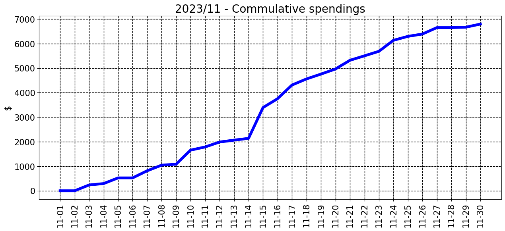

### 2024/12

__________________________________

| Spent | Avg daily | End of month projection | Spent since 2023/1 |
|---|---|---|---|
| $0.0  |  $0.0  | $0.0  |  $32636.0  |

__________________________________

### 2024/11

__________________________________

| Spent | Avg daily | End of month projection | Spent since 2023/1 |
|---|---|---|---|
| $0.0  |  $0.0  | $0.0  |  $32636.0  |

__________________________________

### 2024/10

__________________________________

| Spent | Avg daily | End of month projection | Spent since 2023/1 |
|---|---|---|---|
| $0.0  |  $0.0  | $0.0  |  $32636.0  |

__________________________________

### 2024/9

__________________________________

| Spent | Avg daily | End of month projection | Spent since 2023/1 |
|---|---|---|---|
| $0.0  |  $0.0  | $0.0  |  $32636.0  |

__________________________________

### 2024/8

__________________________________

| Spent | Avg daily | End of month projection | Spent since 2023/1 |
|---|---|---|---|
| $0.0  |  $0.0  | $0.0  |  $32636.0  |

__________________________________

### 2024/7

__________________________________

| Spent | Avg daily | End of month projection | Spent since 2023/1 |
|---|---|---|---|
| $0.0  |  $0.0  | $0.0  |  $32636.0  |

__________________________________

### 2024/6

__________________________________

| Spent | Avg daily | End of month projection | Spent since 2023/1 |
|---|---|---|---|
| $0.0  |  $0.0  | $0.0  |  $32636.0  |

__________________________________

### 2024/5

__________________________________

| Spent | Avg daily | End of month projection | Spent since 2023/1 |
|---|---|---|---|
| $0.0  |  $0.0  | $0.0  |  $32636.0  |

__________________________________

### 2024/4

__________________________________

| Spent | Avg daily | End of month projection | Spent since 2023/1 |
|---|---|---|---|
| $2371.0  |  $169.4  | $5082.0  |  $32636.0  |

__________________________________

### 2024/3

__________________________________

| Spent | Avg daily | End of month projection | Spent since 2023/1 |
|---|---|---|---|
| $4420.0  |  $142.6  | $4421.0  |  $30265.0  |

__________________________________

### 2024/2

__________________________________

| Spent | Avg daily | End of month projection | Spent since 2023/1 |
|---|---|---|---|
| $5532.0  |  $190.8  | $5533.0  |  $25846.0  |

__________________________________

### 2024/1

__________________________________

| Spent | Avg daily | End of month projection | Spent since 2023/1 |
|---|---|---|---|
| $8408.0  |  $271.2  | $8407.0  |  $20313.0  |

__________________________________

### 2023/12

__________________________________

| Spent | Avg daily | End of month projection | Spent since 2023/1 |
|---|---|---|---|
| $4913.0  |  $158.5  | $4914.0  |  $11906.0  |

__________________________________

### 2023/11

__________________________________

| Spent | Avg daily | End of month projection | Spent since 2023/1 |
|---|---|---|---|
| $6993.0  |  $233.1  | $6993.0  |  $6993.0  |

__________________________________

### 2023/10

__________________________________

| Spent | Avg daily | End of month projection | Spent since 2023/1 |
|---|---|---|---|
| $0.0  |  $0.0  | $0.0  |  $0.0  |

__________________________________

### 2023/9

__________________________________

| Spent | Avg daily | End of month projection | Spent since 2023/1 |
|---|---|---|---|
| $0.0  |  $0.0  | $0.0  |  $0.0  |

__________________________________

### 2023/8

__________________________________

| Spent | Avg daily | End of month projection | Spent since 2023/1 |
|---|---|---|---|
| $0.0  |  $0.0  | $0.0  |  $0.0  |

__________________________________

### 2023/7

__________________________________

| Spent | Avg daily | End of month projection | Spent since 2023/1 |
|---|---|---|---|
| $0.0  |  $0.0  | $0.0  |  $0.0  |

__________________________________

### 2023/6

__________________________________

| Spent | Avg daily | End of month projection | Spent since 2023/1 |
|---|---|---|---|
| $0.0  |  $0.0  | $0.0  |  $0.0  |

__________________________________

### 2023/5

__________________________________

| Spent | Avg daily | End of month projection | Spent since 2023/1 |
|---|---|---|---|
| $0.0  |  $0.0  | $0.0  |  $0.0  |

__________________________________

### 2023/4

__________________________________

| Spent | Avg daily | End of month projection | Spent since 2023/1 |
|---|---|---|---|
| $0.0  |  $0.0  | $0.0  |  $0.0  |

__________________________________

### 2023/3

__________________________________

| Spent | Avg daily | End of month projection | Spent since 2023/1 |
|---|---|---|---|
| $0.0  |  $0.0  | $0.0  |  $0.0  |

__________________________________

### 2023/2

__________________________________

| Spent | Avg daily | End of month projection | Spent since 2023/1 |
|---|---|---|---|
| $0.0  |  $0.0  | $0.0  |  $0.0  |

__________________________________

### 2023/1

__________________________________

| Spent | Avg daily | End of month projection | Spent since 2023/1 |
|---|---|---|---|
| $0.0  |  $0.0  | $0.0  |  $0.0  |

__________________________________

