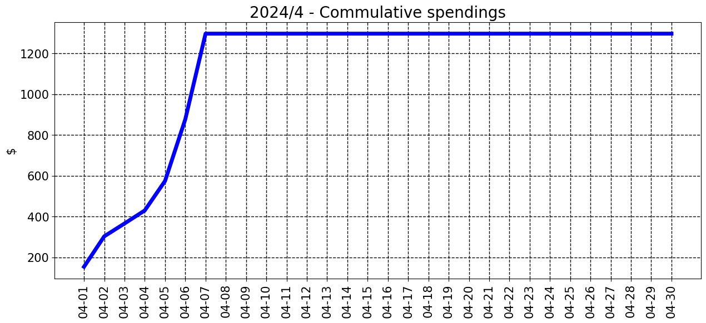
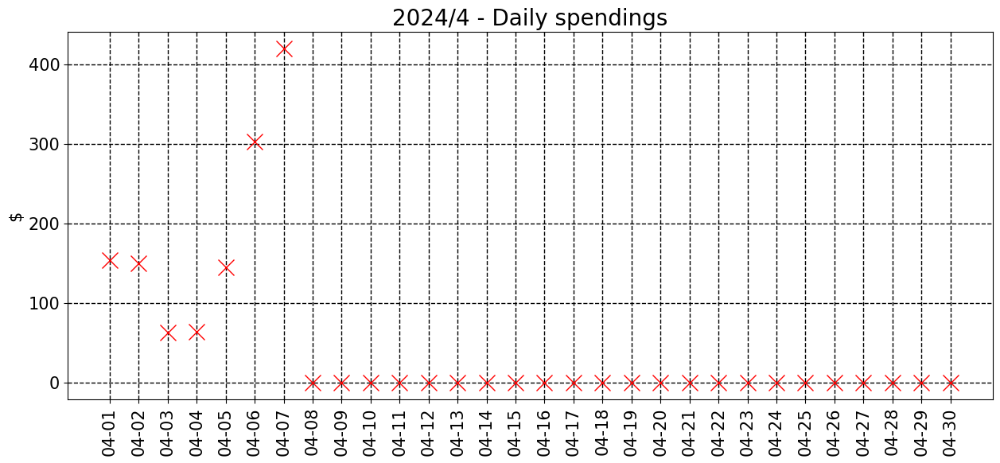

### 2024/12

__________________________________

| Spent | Avg daily | End of month projection | Spent since 2024/1 |
|---|---|---|---|
| $0.0  |  $0.0  | $0.0  |  $10496.0  |

__________________________________

### 2024/11

__________________________________

| Spent | Avg daily | End of month projection | Spent since 2024/1 |
|---|---|---|---|
| $0.0  |  $0.0  | $0.0  |  $10496.0  |

__________________________________

### 2024/10

__________________________________

| Spent | Avg daily | End of month projection | Spent since 2024/1 |
|---|---|---|---|
| $0.0  |  $0.0  | $0.0  |  $10496.0  |

__________________________________

### 2024/9

__________________________________

| Spent | Avg daily | End of month projection | Spent since 2024/1 |
|---|---|---|---|
| $0.0  |  $0.0  | $0.0  |  $10496.0  |

__________________________________

### 2024/8

__________________________________

| Spent | Avg daily | End of month projection | Spent since 2024/1 |
|---|---|---|---|
| $0.0  |  $0.0  | $0.0  |  $10496.0  |

__________________________________

### 2024/7

__________________________________

| Spent | Avg daily | End of month projection | Spent since 2024/1 |
|---|---|---|---|
| $0.0  |  $0.0  | $0.0  |  $10496.0  |

__________________________________

### 2024/6

__________________________________

| Spent | Avg daily | End of month projection | Spent since 2024/1 |
|---|---|---|---|
| $0.0  |  $0.0  | $0.0  |  $10496.0  |

__________________________________

### 2024/5

__________________________________

| Spent | Avg daily | End of month projection | Spent since 2024/1 |
|---|---|---|---|
| $0.0  |  $0.0  | $0.0  |  $10496.0  |

__________________________________

### 2024/4

__________________________________

| Spent | Avg daily | End of month projection | Spent since 2024/1 |
|---|---|---|---|
| $0.0  |  $0.0  | $0.0  |  $10496.0  |

__________________________________

### 2024/3

__________________________________

| Spent | Avg daily | End of month projection | Spent since 2024/1 |
|---|---|---|---|
| $0.0  |  $0.0  | $0.0  |  $10496.0  |

__________________________________

### 2024/2

__________________________________

| Spent | Avg daily | End of month projection | Spent since 2024/1 |
|---|---|---|---|
| $2088.0  |  $208.8  | $6055.0  |  $10496.0  |

__________________________________

### 2024/1

__________________________________

| Spent | Avg daily | End of month projection | Spent since 2024/1 |
|---|---|---|---|
| $8408.0  |  $271.2  | $8407.0  |  $8408.0  |

__________________________________

